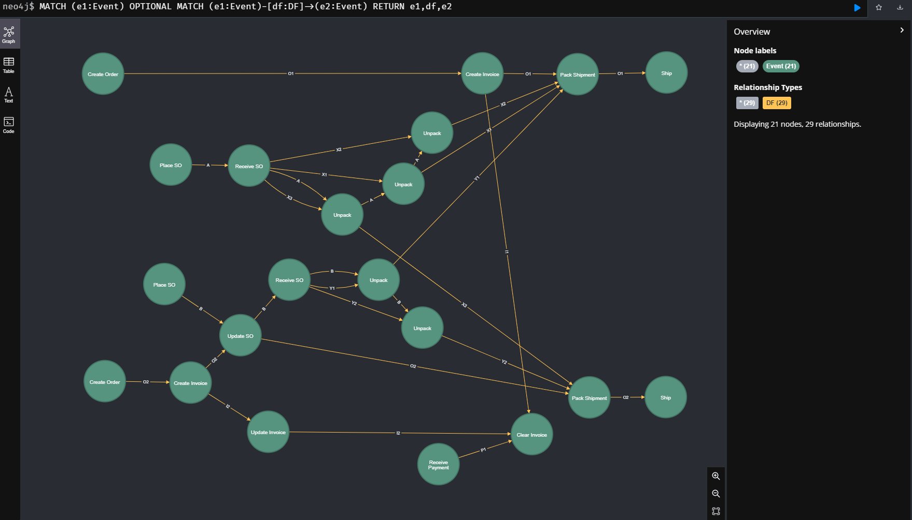

# Tutorial 1: Building Your First Event Knowledge Graph with Neo4j and Cypher (the quick version)

This is the quick version of the [the first tutorial on building event knowledge graphs from event tables](./tutorial-your-first-event-knowledge-graph.md). It skips over all explanations and cuts straight to the essential code and queries. If you need more explanations, head over to [the full tutorial](./tutorial-your-first-event-knowledge-graph.md)

## 1 Download and Install

Setup a new []neo4j](https://neo4j.com/download/) instance; see [the full tutorial](./tutorial-your-first-event-knowledge-graph.md) for details.

## 2 Preparing Event Data for Import

The input data for this tutorial is a single event table in `.csv` format: [./input_logs/order_process_event_table_orderhandling.csv](./input_logs/order_process_event_table_orderhandling.csv). Run [./0_prepare_log_for_import.py](./0_prepare_log_for_import.py) to pre-process the data for import into neo4j, the processed output is stored as [./prepared_logs/order_process_event_table_orderhandling_prepared.csv](./prepared_logs/order_process_event_table_orderhandling_prepared.csv) which is ready for Neo4j import.

## 3 Building Event Knowledge Graphs

The following sections show Cypher queries, copy&paste each Cypher query into the query window of the Neo4j browser connected to your Neo4j instance.

## 4 Importing events

### 4.1 Import event records as event nodes

```
LOAD CSV WITH HEADERS FROM "file:///<eventgraph_tutorial>/order_process/prepared_logs/order_process_event_table_orderhandling_prepared.csv" as line CREATE (e:Event {Log: "order_process",EventID: line.EventID, Activity: line.Activity, timestamp: datetime(line.timestamp), Actor: line.Actor, Order: line.Order, SupplierOrder: line.SupplierOrder, Order_Details: line.Order_Details, Item: line.Item, Invoice: line.Invoice, Payment: line.Payment, Tray: line.Tray })
```
Executing the query should yield the following response
```
Added 21 labels, created 21 nodes, set 151 properties, completed after 10 ms.
```
Note: the above query is not scalable to large input files of 1000s of event records. It also requires you to manually type out all columsn in the CSV data. In another tutorial we show to automate the construction of the query and embed the query into a transaction that will improve performance, but for now we focus on the essence.

### 4.2 Query the event nodes imported

In the Neo4j browser, we can query for the event nodes we just imported and inspect them; see [the full tutorial](./tutorial-your-first-event-knowledge-graph.md) for details. 

### 4.3 Working with lists of values (and necessary pre-processing)

```
# the data has 4 list-valued properties, split strings with commas into lists of strings (4 queries)
MATCH (e:Event) WHERE e.Item <> "null" WITH e,split(e.Item, ',') AS vals 
SET e.Item=vals

MATCH (e:Event) WHERE e.Invoice <> "null" WITH e,split(e.Invoice, ',') AS vals 
SET e.Invoice=vals

MATCH (e:Event) WHERE e.Order_Details <> "null" WITH e,split(e.Order_Details, ',') AS vals 
SET e.Order_Details=vals

MATCH (e:Event) WHERE e.Tray <> "null" WITH e,split(e.Tray, ',') AS vals 
SET e.Tray=vals
```

## 5 Inferring entities

### 5.1 Identify entity types

The data holds the following entity types and entity identifiers.

| property | distinct values |
|----------|-----------------|
| _Order_ | _O1, O2_ |
| _SupplierOrder_ | _A, B_ |
| _Item_ | _X1, X2, X3, Y1, Y2_ |
| _Invoice_ | _I1, I2_ |
| _Payment_ | _P1_ |
| _Actor_ | _R1, R2, R3, R4, R5_ |

### 5.2 Create entity nodes

```
# materialize each distinct entity identifier value of an entity type as a new unique :Entity node (5 queries)
MATCH (e:Event) UNWIND e.Order AS id_val WITH DISTINCT id_val 
MERGE (:Entity {ID:id_val, EntityType:"Order"})

MATCH (e:Event) UNWIND e.SupplierOrder AS id_val WITH DISTINCT id_val 
MERGE (:Entity {ID:id_val, EntityType:"SupplierOrder"})

MATCH (e:Event) UNWIND e.Item AS id_val WITH DISTINCT id_val 
MERGE (:Entity {ID:id_val, EntityType:"Item"})

MATCH (e:Event) UNWIND e.Invoice AS id_val WITH DISTINCT id_val 
MERGE (:Entity {ID:id_val, EntityType:"Invoice"})

MATCH (e:Event) UNWIND e.Payment AS id_val WITH DISTINCT id_val 
MERGE (:Entity {ID:id_val, EntityType:"Payment"})
```

For now, we do not add `:Entity` dnoes for __Actor__ entities for now to keep the graph structure simpler. Querying for all nodes in the graph with `MATCH (n) return n` shows us a graph of 21 `:Event` nodes and 12 `:Entity` nodes that are all disconnected.


### 5.3 Correlate events to entity nodes


```
# Add correlation relationships between events and the entities they refer to (5 queries)
MATCH (e:Event) UNWIND e.Order AS id_val WITH e,id_val 
MATCH (n:Entity {EntityType: "Order"})
WHERE id_val = n.ID MERGE (e)-[:CORR]->(n)

MATCH (e:Event) UNWIND e.SupplierOrder AS id_val WITH e,id_val 
MATCH (n:Entity {EntityType: "SupplierOrder"}) 
WHERE id_val = n.ID MERGE (e)-[:CORR]->(n)

MATCH (e:Event) UNWIND e.Item AS id_val WITH e,id_val 
MATCH (n:Entity {EntityType: "Item"}) WHERE id_val = n.ID 
MERGE (e)-[:CORR]->(n)

MATCH (e:Event) UNWIND e.Invoice AS id_val WITH e,id_val 
MATCH (n:Entity {EntityType: "Invoice"}) WHERE id_val = n.ID 
MERGE (e)-[:CORR]->(n)

MATCH (e:Event) UNWIND e.Payment AS id_val WITH e,id_val 
MATCH (n:Entity {EntityType: "Payment"}) WHERE id_val = n.ID
MERGE (e)-[:CORR]->(n)
```

### 5.4 Querying for correlation information

`MATCH (n:Entity)<-[c:CORR]-(e:Event) RETURN e,c,n` gives us the following network of events and entities.

")

## 6. Inferring temporal relations

### 6.1 Infer directly-follows relationships per entity

```
# infer directly-follows relation of all events correlated to the same entity (1 query for all entities)
MATCH (n:Entity)
MATCH (n)<-[:CORR]-(e)
WITH n, e AS nodes ORDER BY e.timestamp, ID(e)
WITH n, collect(nodes) AS event_node_list
UNWIND range(0, size(event_node_list)-2) AS i
WITH n, event_node_list[i] AS e1, event_node_list[i+1] AS e2
MERGE (e1)-[df:DF {EntityType:n.EntityType, ID:n.ID}]->(e2)
```

### 6.2 Querying the graph of Events and directly-follows relationships

Querying with `MATCH (e1:Event) OPTIONAL MATCH (e1:Event)-[df:DF]->(e2:Event) RETURN e1,df,e2` gives us the following graph.



## 7. Wrap-Up and next steps

Congratulations! Head over to [the full tutorial](./tutorial-your-first-event-knowledge-graph.md) for details on the next steps.